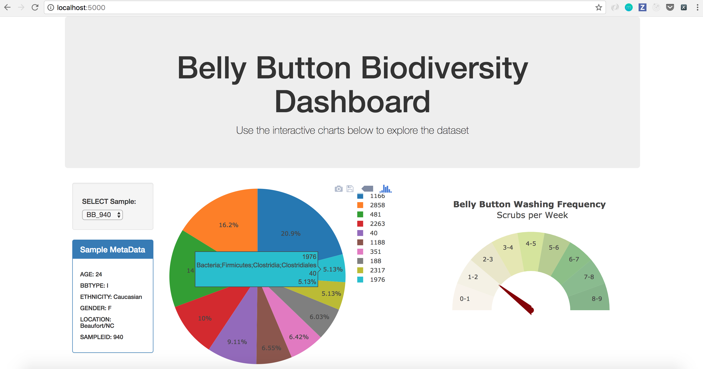
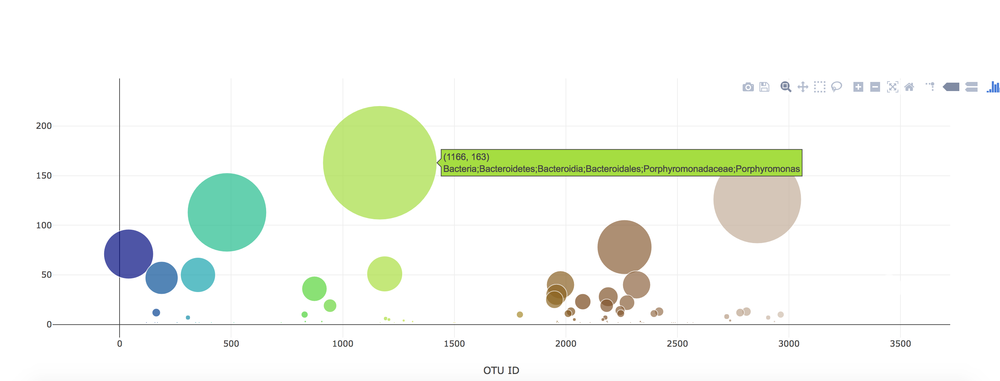

Belly Button App:
https://deepakarnani.github.io/belly-button-biodiversity/

# Belly Button Biodiversity

An interactive dashboard to explore the [Belly Button Biodiversity DataSet](http://robdunnlab.com/projects/belly-button-biodiversity/).

Plotly.js is used to build interactive charts for the dashboard. 

